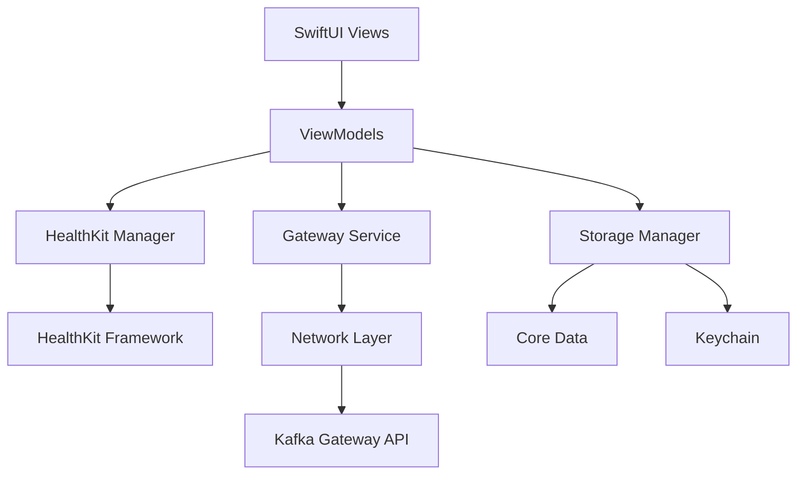
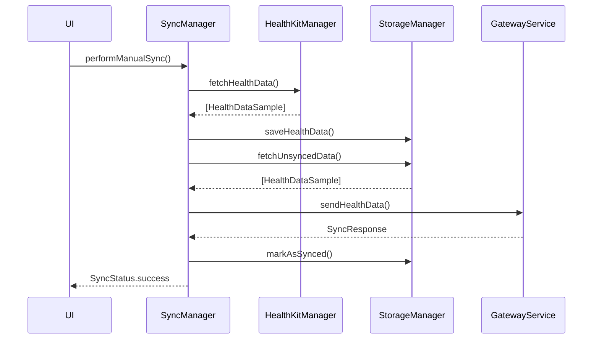
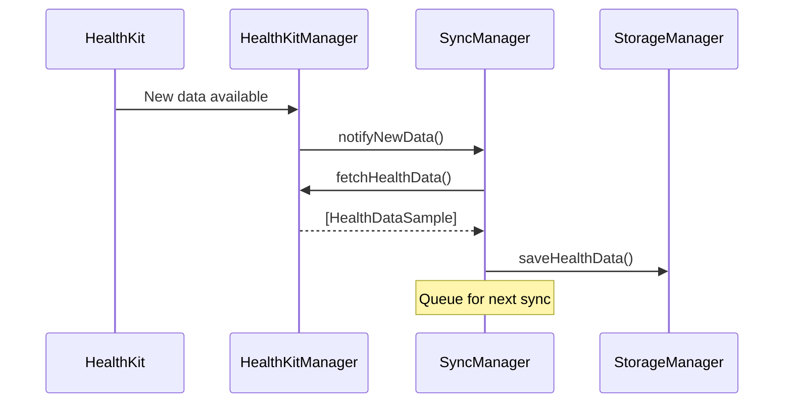

# Design Document

## Overview

이 iOS 애플리케이션은 HealthKit에서 건강 데이터를 추출하여 Kafka 게이트웨이로 전송하는 시스템입니다. SwiftUI를 사용한 네이티브 iOS 앱으로 구현되며, MVVM 아키텍처 패턴을 따릅니다. 백그라운드 동기화, 로컬 데이터 캐싱, 재시도 메커니즘을 포함하여 안정적인 데이터 전송을 보장합니다.

## Architecture

### High-Level Architecture



### Architecture Pattern

**MVVM (Model-View-ViewModel)**
- Views: SwiftUI views for UI presentation
- ViewModels: Business logic and state management
- Models: Data models and entities
- Services: Reusable service layers (HealthKit, Network, Storage)

### Key Components

1. **Presentation Layer**
   - SwiftUI Views
   - ViewModels with Combine publishers

2. **Business Logic Layer**
   - HealthKit Manager: HealthKit data extraction
   - Gateway Service: API communication
   - Sync Manager: Synchronization orchestration
   - Configuration Manager: App settings management

3. **Data Layer**
   - Core Data: Local data persistence
   - Keychain: Secure credential storage
   - UserDefaults: App preferences

4. **Network Layer**
   - URLSession-based HTTP client
   - Request/Response models
   - Error handling and retry logic

## Components and Interfaces

### 1. HealthKit Manager

**Responsibilities:**
- Request HealthKit permissions
- Query health data from HealthKit
- Monitor health data updates
- Convert HealthKit samples to app models

**Interface:**
```swift
protocol HealthKitManagerProtocol {
    func requestAuthorization(for types: Set<HealthDataType>) async throws
    func fetchHealthData(type: HealthDataType, from: Date, to: Date) async throws -> [HealthDataSample]
    func startObservingHealthData(types: Set<HealthDataType>)
    func stopObservingHealthData()
}
```

**Key Methods:**
- `requestAuthorization`: Request user permission for health data access
- `fetchHealthData`: Retrieve health data for a specific type and date range
- `startObservingHealthData`: Enable background observation for data changes
- `stopObservingHealthData`: Disable background observation

### 2. Gateway Service

**Responsibilities:**
- Send health data to Kafka gateway
- Handle authentication
- Manage network requests
- Implement retry logic

**Interface:**
```swift
protocol GatewayServiceProtocol {
    func configure(endpoint: GatewayEndpoint)
    func sendHealthData(_ data: [HealthDataPayload]) async throws -> SyncResponse
    func testConnection() async throws -> Bool
    func validateSecureConnection() throws
}
```

**Key Methods:**
- `configure`: Set gateway endpoint and credentials (validates HTTPS)
- `sendHealthData`: Send batch of health data to gateway via HTTPS
- `testConnection`: Verify gateway connectivity over secure connection
- `validateSecureConnection`: Ensure endpoint uses HTTPS protocol

### 3. Sync Manager

**Responsibilities:**
- Orchestrate data synchronization
- Manage sync queue
- Handle sync scheduling
- Track sync status

**Interface:**
```swift
protocol SyncManagerProtocol {
    func startAutoSync()
    func stopAutoSync()
    func performManualSync() async throws
    func getSyncStatus() -> SyncStatus
    func getSyncHistory() -> [SyncRecord]
}
```

**Key Methods:**
- `startAutoSync`: Enable automatic background sync
- `stopAutoSync`: Disable automatic sync
- `performManualSync`: Trigger immediate sync
- `getSyncStatus`: Get current sync state
- `getSyncHistory`: Retrieve sync history

### 4. Storage Manager

**Responsibilities:**
- Persist health data locally
- Store sync metadata
- Manage data encryption
- Handle data cleanup

**Interface:**
```swift
protocol StorageManagerProtocol {
    func saveHealthData(_ data: [HealthDataSample], userId: String) async throws
    func fetchUnsyncedData() async throws -> [HealthDataSample]
    func markAsSynced(ids: [UUID]) async throws
    func deleteOldData(olderThan: Date) async throws
}
```

### 5. Configuration Manager

**Responsibilities:**
- Manage app settings
- Store gateway configuration
- Handle user preferences
- Secure credential management

**Interface:**
```swift
protocol ConfigurationManagerProtocol {
    func saveGatewayConfig(_ config: GatewayConfig) throws
    func getGatewayConfig() throws -> GatewayConfig?
    func saveDataTypePreferences(_ preferences: [HealthDataType: Bool])
    func getDataTypePreferences() -> [HealthDataType: Bool]
    func saveSyncFrequency(_ frequency: SyncFrequency)
    func getSyncFrequency() -> SyncFrequency
    func saveUserId(_ userId: String)
    func getUserId() -> String?
}
```

## Data Models

### HealthDataType

```swift
enum HealthDataType: String, CaseIterable {
    // Body Measurements
    case height
    case bodyMass
    case bodyMassIndex
    case bodyFatPercentage
    case waistCircumference
    
    // Activity
    case stepCount
    case distanceWalkingRunning
    case flightsClimbed
    case activeEnergyBurned
    case basalEnergyBurned
    case exerciseTime
    case standHours
    
    // Cardiovascular
    case heartRate
    case restingHeartRate
    case heartRateVariability
    case bloodPressureSystolic
    case bloodPressureDiastolic
    case oxygenSaturation
    
    // Sleep
    case sleepAnalysis
    case timeInBed
    
    // Nutrition
    case dietaryEnergy
    case dietaryProtein
    case dietaryCarbohydrates
    case dietaryFat
    case dietaryWater
    
    // Respiratory
    case respiratoryRate
    case vo2Max
    
    // Other
    case bloodGlucose
    case bodyTemperature
    case mindfulMinutes
    
    var category: HealthDataCategory { ... }
    var unit: HKUnit { ... }
    var hkQuantityType: HKQuantityTypeIdentifier { ... }
}
```

### HealthDataCategory

```swift
enum HealthDataCategory: String, CaseIterable {
    case bodyMeasurements
    case activity
    case cardiovascular
    case sleep
    case nutrition
    case respiratory
    case other
    
    var displayName: String { ... }
    var dataTypes: [HealthDataType] { ... }
}
```

### HealthDataSample

```swift
struct HealthDataSample: Identifiable, Codable {
    let id: UUID
    let type: HealthDataType
    let value: Double
    let unit: String
    let startDate: Date
    let endDate: Date
    let sourceBundle: String?
    let metadata: [String: String]?
    var isSynced: Bool
    let createdAt: Date
}

// Note: userId is not included in Sample to avoid duplication.
// It is stored at the Payload level and in Core Data (HealthDataEntity).
```

### HealthDataPayload

```swift
struct HealthDataPayload: Codable {
    let deviceId: String
    let userId: String  // Required for data lake partitioning
    let samples: [HealthDataSample]
    let timestamp: Date
    let appVersion: String
}
```

### GatewayConfig

```swift
struct GatewayConfig: Codable {
    let baseURL: String  // Must start with https://
    let port: Int?
    let apiKey: String?
    let username: String?
    let password: String?
    
    var fullURL: URL { ... }
    
    func validate() throws {
        guard baseURL.lowercased().hasPrefix("https://") else {
            throw GatewayError.insecureConnection
        }
    }
}
```

### SyncStatus

```swift
enum SyncStatus {
    case idle
    case syncing(progress: Double)
    case success(syncedCount: Int, timestamp: Date)
    case error(Error, timestamp: Date)
}
```

### SyncRecord

```swift
struct SyncRecord: Identifiable, Codable {
    let id: UUID
    let timestamp: Date
    let status: SyncRecordStatus
    let syncedCount: Int
    let errorMessage: String?
    let duration: TimeInterval
}

enum SyncRecordStatus: String, Codable {
    case success
    case partialSuccess
    case failed
}
```

### SyncFrequency

```swift
enum SyncFrequency: String, CaseIterable {
    case realtime
    case hourly
    case daily
    case manual
    
    var displayName: String { ... }
    var interval: TimeInterval? { ... }
}
```

## User Interface Design

### Main Screen
- Sync status indicator
- Last sync timestamp
- Quick sync button
- Data type summary (enabled/disabled count)
- Navigation to settings and history

### Settings Screen
- Gateway configuration section
- Data type selection (grouped by category)
- Sync frequency selector
- HealthKit permissions status
- App information

### Sync History Screen
- List of recent sync attempts
- Status indicators (success/error)
- Timestamp and duration
- Error details (expandable)

### Gateway Configuration Screen
- URL input field
- Port input field
- Authentication method selector
- Credential input fields
- Test connection button
- Save button

## Data Flow

### Sync Flow



### Background Observation Flow



## Error Handling

### Error Types

```swift
enum HealthKitError: Error {
    case notAvailable
    case authorizationDenied
    case dataNotAvailable
    case queryFailed(Error)
}

enum GatewayError: Error {
    case invalidConfiguration
    case insecureConnection  // HTTP not allowed, HTTPS required
    case networkError(Error)
    case authenticationFailed
    case serverError(statusCode: Int, message: String)
    case timeout
    case sslValidationFailed
}

enum StorageError: Error {
    case saveFailed(Error)
    case fetchFailed(Error)
    case encryptionFailed
}
```

### Error Handling Strategy

1. **Network Errors:**
   - Implement exponential backoff retry (1s, 2s, 4s, 8s, 16s)
   - Queue failed requests for later retry
   - Display user-friendly error messages

2. **HealthKit Errors:**
   - Prompt user to grant permissions
   - Provide deep link to Settings
   - Log errors for debugging

3. **Storage Errors:**
   - Implement data recovery mechanisms
   - Alert user if storage is full
   - Automatic cleanup of old data

4. **Gateway Errors:**
   - Validate configuration before saving
   - Test connection before enabling sync
   - Provide detailed error messages

## Security Considerations

### Data Protection

1. **Encryption at Rest:**
   - Use Core Data encryption for local storage
   - Store credentials in iOS Keychain
   - Enable Data Protection for app files

2. **Encryption in Transit:**
   - **Mandatory HTTPS/TLS:** All network requests MUST use HTTPS protocol only
   - Reject any HTTP connections (no fallback to insecure connections)
   - Validate SSL certificates for all requests
   - Use certificate pinning for production environment
   - Implement App Transport Security (ATS) with no exceptions

3. **Authentication:**
   - Support API key authentication
   - Support username/password authentication
   - Securely store credentials in Keychain

### Privacy

1. **Data Minimization:**
   - Only request necessary HealthKit permissions
   - Allow users to select specific data types
   - Don't store unnecessary metadata

2. **User Control:**
   - Clear permission explanations
   - Easy opt-out mechanism
   - Data deletion on app uninstall

## Background Execution

### Background Modes

Enable the following background modes:
- Background fetch
- Background processing

### Background Tasks

```swift
// Register background tasks
BGTaskScheduler.shared.register(
    forTaskWithIdentifier: "com.app.healthsync",
    using: nil
) { task in
    handleHealthSyncTask(task as! BGProcessingTask)
}
```

### Scheduling Strategy

- **Real-time:** Use HealthKit background delivery
- **Hourly:** Schedule BGProcessingTask every hour
- **Daily:** Schedule BGProcessingTask once per day
- **Manual:** No background scheduling

## Performance Optimization

### Data Batching

- Batch health data queries (max 1000 samples per query)
- Batch network requests (max 100 samples per request)
- Use pagination for large datasets

### Caching Strategy

- Cache HealthKit authorization status
- Cache last sync timestamp per data type
- Cache gateway configuration

### Memory Management

- Use lazy loading for large datasets
- Implement data streaming for network requests
- Release resources when app enters background

## Testing Strategy

### Unit Tests

- HealthKit Manager: Mock HealthKit queries
- Gateway Service: Mock network responses
- Storage Manager: In-memory Core Data stack
- Sync Manager: Mock dependencies

### Integration Tests

- End-to-end sync flow
- Background task execution
- Error recovery scenarios
- Data persistence

### UI Tests

- User flows (onboarding, configuration, sync)
- Error state handling
- Accessibility compliance

### Manual Testing

- Test with real HealthKit data
- Test on different iOS versions
- Test network conditions (offline, slow)
- Test background execution

## Dependencies

### iOS Frameworks

- HealthKit: Health data access
- SwiftUI: User interface
- Combine: Reactive programming
- Core Data: Local persistence
- BackgroundTasks: Background execution
- Security: Keychain access

### Third-Party Libraries (Optional)

- Alamofire: Advanced networking (if needed)
- KeychainAccess: Simplified Keychain wrapper
- SwiftLint: Code quality

## Deployment Considerations

### Minimum iOS Version

- iOS 16.0+ (for latest HealthKit features and SwiftUI improvements)

### App Capabilities

- HealthKit
- Background Modes
- Keychain Sharing (if needed)

### Privacy Descriptions (Info.plist)

```xml
<key>NSHealthShareUsageDescription</key>
<string>We need access to your health data to sync it with your personal health dashboard.</string>

<key>NSHealthUpdateUsageDescription</key>
<string>This app does not write health data.</string>
```

### App Store Requirements

- Clear privacy policy
- Explain data usage
- Comply with HealthKit guidelines
- No selling of health data

## Future Enhancements

1. **Data Compression:** Compress payloads before transmission
2. **Differential Sync:** Only send changed data
3. **Multi-Gateway Support:** Support multiple gateway endpoints
4. **Data Visualization:** Show health data trends in app
5. **Conflict Resolution:** Handle data conflicts from multiple sources
6. **Offline Mode:** Full offline support with sync queue
7. **Push Notifications:** Notify users of sync status
8. **Widget Support:** Show sync status in home screen widget
